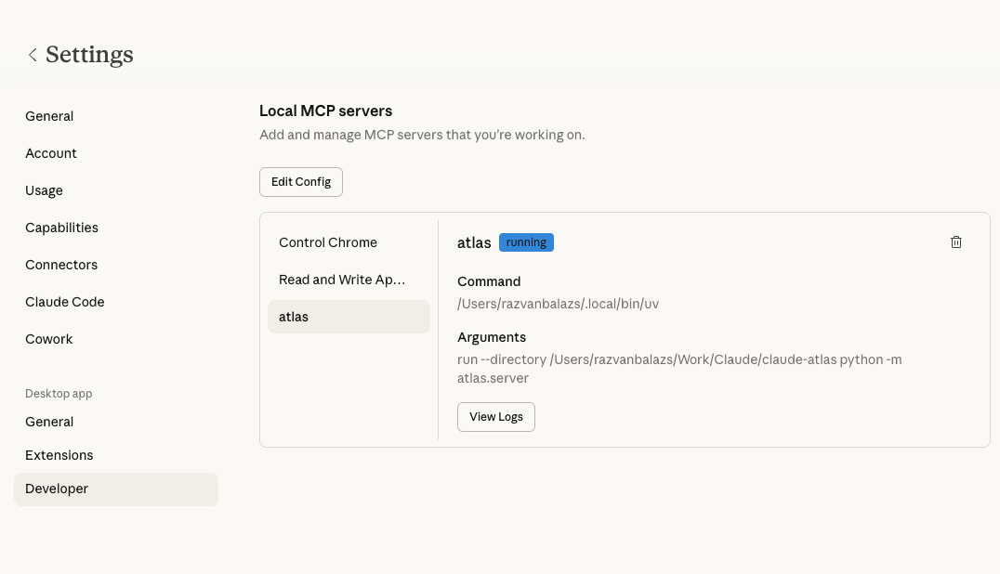

# claude-atlas

An MCP (Model Context Protocol) server that gives Claude Code access to [Atlassian Atlas](https://www.atlassian.com/software/atlas) -- Atlassian's project tracking and teamwork directory.

## What it does

claude-atlas exposes Atlas project data as MCP tools, allowing Claude Code to read and update your Atlas projects through natural conversation. It communicates with the Atlas GraphQL API using Basic Auth.

### MCP Tools

| Tool | Description |
|------|-------------|
| `list_projects` | List all non-archived projects, sorted by most recently updated |
| `create_project` | Create a project with a name, description, and optional goal link, tag, and Jira issue link |
| `get_project` | Get details of a single project by ID (name, description, state, due date, owner, members) |
| `get_projects` | Get details of multiple projects by their IDs |
| `get_project_updates` | Get status updates and highlights for a project |
| `create_project_update` | Post a new status update with summary, status, and highlights |
| `archive_project` | Archive or unarchive a project |
| `atlas_graphql_query` | Execute a raw GraphQL query against the Atlas API |

### Claude Code Skills

The server also ships with Claude Code slash command skills. They live in
`.claude/skills/`, so anyone who clones this repo gets them automatically — no
separate install. Each skill calls the `atlas` MCP tools, so the server must be
configured (see Setup below) for them to work.

- `/atlas-projects` -- List and browse your Atlas projects in a formatted table
- `/atlas-create` -- Create one or more projects, optionally linked to a goal, tagged, and linked to Jira issues
- `/atlas-status` -- View the latest status updates for a project
- `/atlas-update` -- Compose and post a new status update to a project
- `/atlas-my-updates` -- List status updates for projects you own or contribute to
- `/atlas-tag` -- List projects filtered by a tag

## Install as a plugin (recommended for sharing)

This repo is a Claude Code plugin marketplace, so anyone in the org can install
the MCP server **and** all the skills in one step:

```bash
/plugin marketplace add razvan-sc/claude-atlas
/plugin install atlas@safetyculture-atlas
```

Skills are then available namespaced as `/atlas:create`, `/atlas:projects`,
`/atlas:status`, and so on. To pick up new versions after changes are pushed:

```bash
/plugin marketplace update safetyculture-atlas
```

Two per-user prerequisites still apply:

- [`uv`](https://docs.astral.sh/uv/) must be installed — the bundled `atlas` MCP
  server runs via `uv run`.
- Each user needs their own `~/.atlas/config.json` (see [Setup](#setup) below) —
  credentials are personal and are not bundled with the plugin.

## Setup

### 1. Create a config file

```bash
mkdir -p ~/.atlas
cat > ~/.atlas/config.json << 'EOF'
{
  "email": "you@company.com",
  "api_token": "your-atlassian-api-token",
  "subdomain": "yoursite"
}
EOF
```

- `email` -- Your Atlassian account email
- `api_token` -- An [Atlassian API token](https://id.atlassian.com/manage-profile/security/api-tokens)
- `subdomain` -- Your Atlassian site name (the `yoursite` part of `yoursite.atlassian.net`)
- `cloud_id` (optional) -- Your Atlassian cloud ID. If omitted, it will be resolved automatically.

### 2. Install

```bash
pip install -e .
```

### 3. Add to Claude Code

Add the server to your `.mcp.json`:

```json
{
  "mcpServers": {
    "atlas": {
      "command": "atlas"
    }
  }
}
```

### 4. Add to Claude Desktop

Open **Settings → Developer** in the Claude Desktop app, click **Edit Config**, and add the following to your `claude_desktop_config.json`:

```json
{
  "mcpServers": {
    "atlas": {
      "command": "uv",
      "args": [
        "run",
        "--directory", "/path/to/claude-atlas",
        "python", "-m", "atlas.server"
      ]
    }
  }
}
```

Replace `/path/to/claude-atlas` with the absolute path to your local clone of this repo. After saving, restart Claude Desktop — the server should appear under **Settings → Developer** with a `running` status.



## Development

Requires Python 3.10+.

```bash
# Install with dev dependencies
pip install -e ".[dev]"

# Run tests
pytest
```

## Project structure

```
src/atlas/
  config.py          # Config loader (~/.atlas/config.json)
  graphql_client.py  # Async GraphQL client with Basic Auth
  queries.py         # GraphQL query and mutation strings
  server.py          # MCP tool definitions and server entrypoint
```
